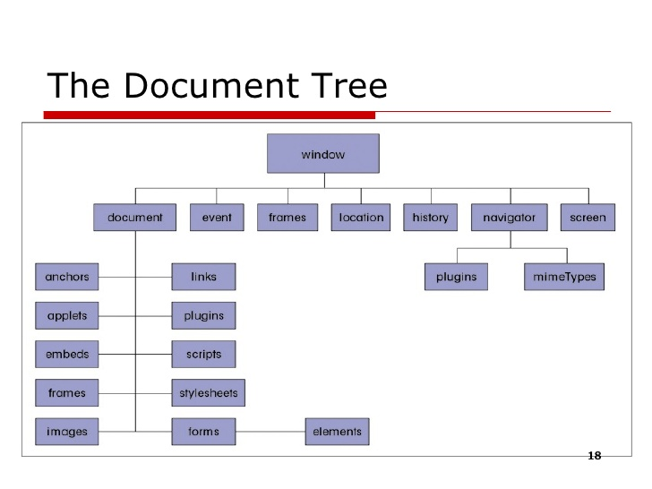

# researchGetType [Electron]


**What is it?** This is a project that was only intended for personal research use. Do what you please, it was mean't to help identify
how getType works in electron and help create the documentation for getType in Electron!

**Status**:
- [x] Identify when window loads
- [x] Inject custom string from main.js into index.html
- [ ] Identify how getType works. (It's buggy and not working like it should. Seems like code in C++ of electron is missing)

**What I found so far**
I found out that when I execute this code in main.js:

```sh
1     mainWindow.webContents.on('dom-ready', () => {
2       console.log("DOM: Ready");
3       //verify that if getType is window true, then execute code
4        if (mainWindow.webContents.getType() == "window") {
5          console.log(mainWindow.webContents)
6          //execute javascript
7          mainWindow.webContents.executeJavaScript("var element = document.getEle" +
8          "mentById('changeMe'); element.innerHTML = 'Injected from main.js!';");
9        }
10   });
```

I am able to find that in the 4th line I can use .getType() for the webContents.
This returns: window . I was confused at first how this may be getting window as
the result. I opened my javascript and ajax book to hope that there may be some
documentation on the struture of a browser or html tab window. Luckily and to
my surprise, I found the perfect structure example! (Shown below)



Currently I've been testing different scripts to try to identify what scripts
would work in main.js to figure out all possibilities with it. Maybe we can
use: document.getElementById(elementID) but window has to go first because it
is the parent of document. Just look at the picture I showed above.

I believe if I can do something like this (4th line), I could get as deep as using
.getType() for actual strings, booleans, etc. so that we can see the structure.

```sh
4        if (mainWindow.webContents.getType() == "window") {
5             console.log(mainWindow.webContents.getAllWebContents.getType())
6        }
```

The following script below allow me to see the data structure of the main.js
data! Kinda cool! This helps us understand what events are programmed in Electron
and shows us functions that may help us find out later how we can apply this to
the .getType() function.

```sh
4        if (mainWindow.webContents.getType() == "window") {
5             console.log(webContents.getAllWebContents())
6        }
```
